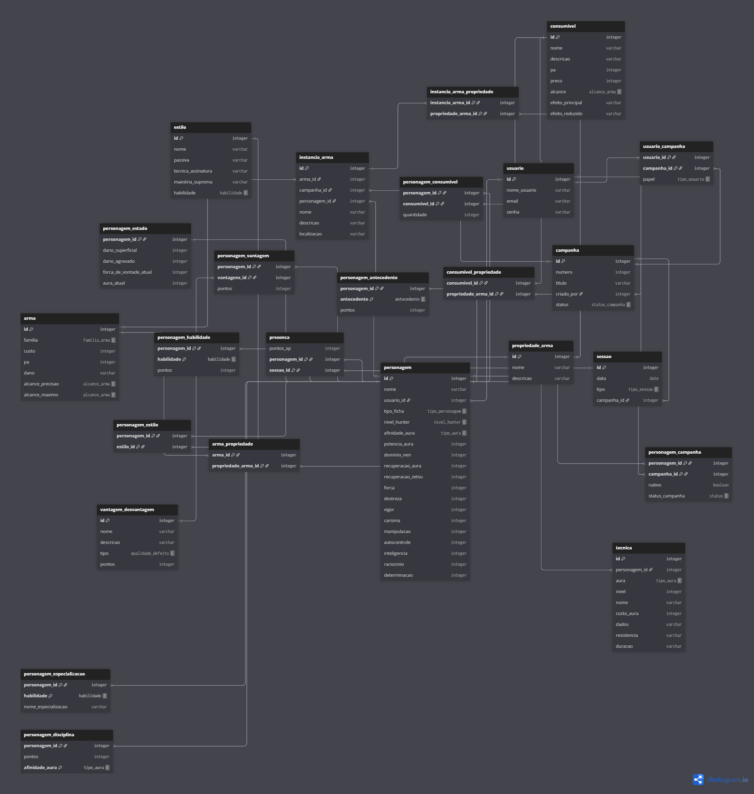

# 🗄️ Schema do Banco de Dados

Modelo de dados do RPGxRPG. Gerado e mantido no [dbdiagram.io](https://dbdiagram.io).

## Diagrama

## Fonte

O arquivo DBML completo com todas as tabelas, enums e relacionamentos
está em [`BANCOxBANCO.dbml`](./BANCOxBANCO.dbml).
